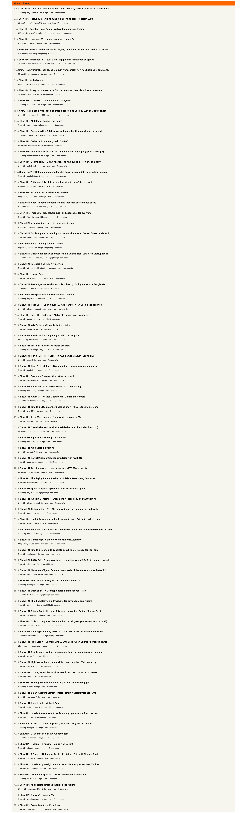

# HackerNewsUi

## Overview

This Hacker News is a news application that fetches and displays news stories. It features infinite scrolling and a "time ago" format for timestamps. The application uses Angular's signal API for state management and incorporates a standalone component for the news display.

## Features

- Fetches news stories from an API.
- Displays stories with titles and publication timestamps.
- Implements infinite scrolling to load more stories as the user scrolls.
- Uses a custom pipe to display time in a "time ago" format.

## Technologies Used

- Angular
- RxJS
- TypeScript
- date-fns (for date formatting)

## Project Overview

Watch the project overview video [here](https://drive.google.com/file/d/1oGqrafm_WLiG4S8hGOsm6qDMMg6_I4Gv/view?usp=sharing).

## Installation

1. Clone the repository:

   ```bash
   git clone https://github.com/yourusername/news-app.git
   cd news-app
   ```

2. Install the dependencies:

   ```bash
   npm install
   ```

3. Serve the application:

   ```bash
   ng start
   ```

4. Open your browser and navigate to `http://localhost:4200/`.

## Reference the Screenshot 




## Usage

### NewsComponent

The `NewsComponent` is the main component that handles the display of news stories. It includes the following functionalities:

- **Fetch All Feeds**: On initialization, the component fetches all news feed IDs.
- **Load News Stories**: After fetching the IDs, it retrieves individual news stories using their IDs.
- **Infinite Scrolling**: As the user scrolls, more stories are fetched and displayed.
- **Time Formatting**: Timestamps are formatted into a "time ago" format using the `TimeAgoPipe`.


## Development


### Building the Project

To build the project for production, run:

```bash
ng build --prod
```